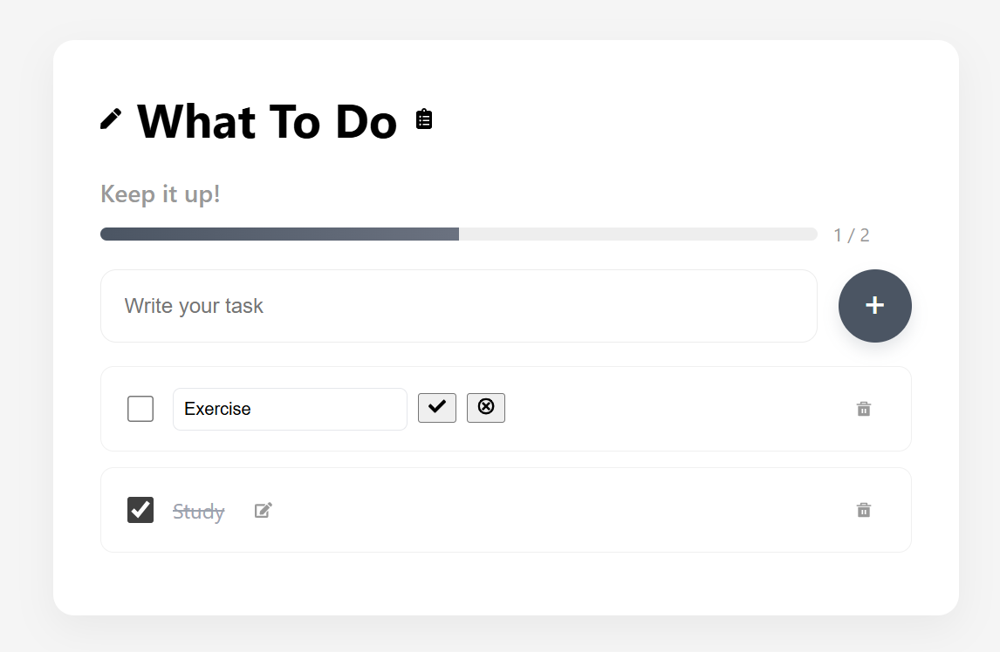
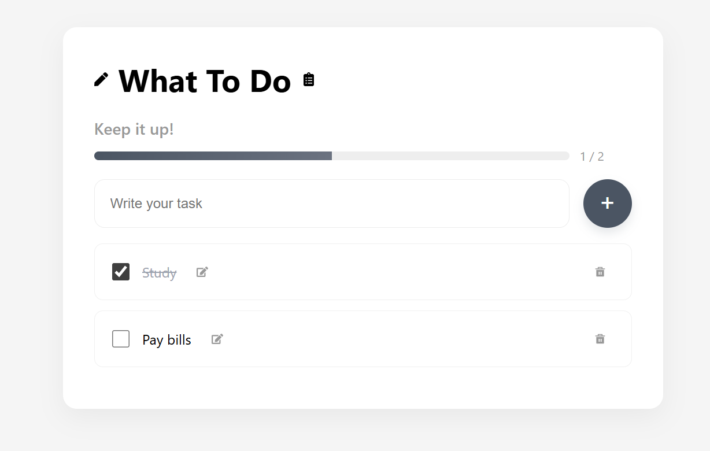

# Task 2: Simple Todo List App with React + TypeScript

## Project Description

This project is a **Todo List application** built using **TypeScript**.  
The application allows users to **add**, **edit**, **mark as done**, and **delete** tasks.  
All tasks are stored in the browser's `localStorage` to ensure they persist between sessions.

The project demonstrates the use of:

- TypeScript interfaces
- DOM manipulation
- Functions for managing tasks
- Persistent storage using `localStorage`

---

## Features

- Add, edit, and delete todos
- Mark todos as completed / uncompleted
- Persist todos in browser `localStorage`
- Built with React + TypeScript and bundled with Vite

## Tech Stack

- React
- TypeScript
- Vite
- CSS
- HTML

## Screenshots



## Getting Started

Prerequisites: Node.js and npm. The shell below assumes `bash`.

1. Clone the repo:

```bash
git clone https://github.com/eelut/A2SV_WebTrack_Task4.git
cd "ToDo App"
```

2. Install dependencies:

```bash
npm install
npm install react-icons
```

3. Run the development server:

```bash
npm run dev
```

Open the URL printed by Vite (usually `http://localhost:5173`).


